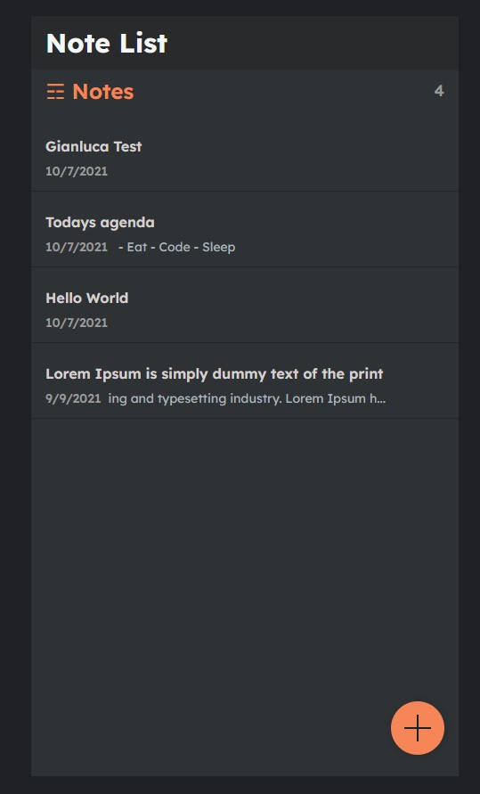

## notes-app

Doucmenting my journey of learning front-end development with react and back-end with Django. 

Building out the front-end react and back-end with Django. Simple notes application where a user can edit items, 
add items, and remove them. Learning to Work with a different way to add the data along with trimming down the data to render down things like dates and body sections. The point of this project was for me to learn how to connect Django with React.

## Download & Setup Instructions

* Clone project: git clone https://github.com/GianlucaVend/notes-app
* cd notes-app
* Create virtual environment: virtualenv myenv
* myenv\scripts\activate
* pip install -r requirements.txt
* python manage.py runserver
